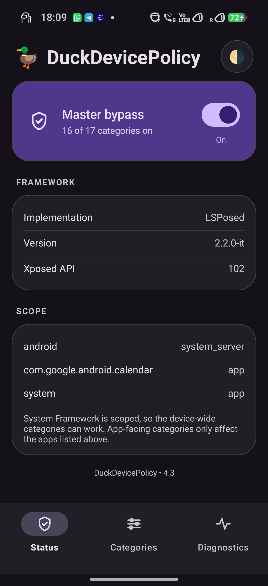

# DuckDevicePolicy

Makes apps see **no device-policy restrictions** on your own device —
`DevicePolicyManager` / `UserManager` checks answered "no restriction", per
category, behind a master toggle. Formerly DuckPolicy, same package. Fork of
[liyafe1997/FuckDevicePolicy](https://github.com/liyafe1997/FuckDevicePolicy).

**Needs an LSPosed 2.x fork** (Xposed API 101+). Mainline 1.9.x will not load it.

**Scope matters.** Tick every framework entry your manager offers — `android`, `system`,
`system_server` — or the device-wide categories do nothing. Everything else only affects
apps you scope; Photos (Locked Folder) and Outlook are recommended.

**Never scope Intune / Company Portal / Authenticator** — they enforce policy rather than
read it, so spoofing them just triggers compliance retries or a remote wipe. Teams and other
MAM apps don't use `DevicePolicyManager` at all.

**Not working?** The LSPosed log has `installed N/M hooks in <process>`, followed by
`unresolved in <process> [n]: ...` naming every row that did not resolve, and
`first hit: <category> ...` the first time one fires. Quote those when reporting.

Build with `./gradlew :app:assembleRelease` (JDK 17, compileSdk 36). A `v*` tag publishes
a release.

**The signing key is in the repo on purpose** (`app/duckpolicy.jks`, password `duckpolicy`)
so any checkout produces an installable, updateable APK with no secret setup. Know what that
costs: a build is not evidence of origin, and anyone can produce an APK your device will
accept as an in-place *update* to this module — which is code running in system_server. Install
releases from this repo, or build it yourself.

[CHANGELOG](CHANGELOG.md) · [LICENSE](LICENSE)
